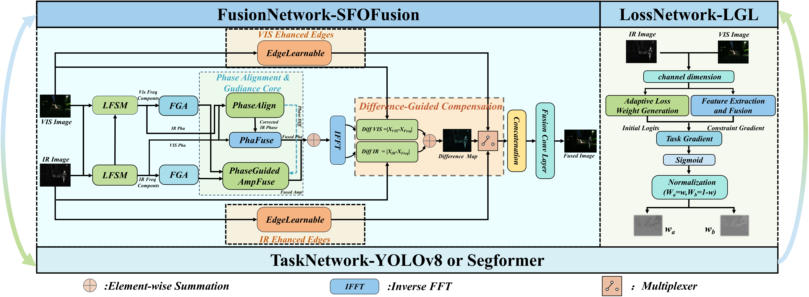
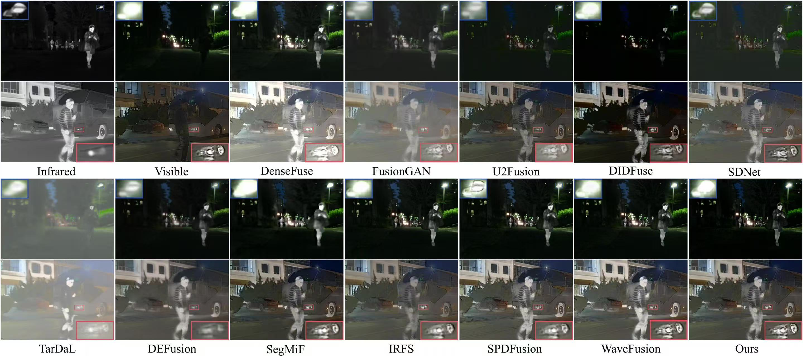

# SFOFusion: A Task-Oriented Meta-Learning Framework for Spatial–Frequency Fusion of Infrared and Visible Images

## Abstract
Infrared and visible image fusion plays a crucial role in various applications such as computer vision and remote sensing, especially in low-visibility environments, where it combines the powerful perception capability of infrared images in low light with the rich detail information of visible images. However, existing methods typically process image features separately in either the spatial or frequency domain, neglecting the deep fusion and optimization of cross-domain information. Moreover, few methods consider how to jointly optimize downstream tasks with spatial-frequency fusion models. To address these issues, we propose a task-oriented meta-learning framework, SFOFusion, which integrates phase information from the frequency domain with an explicit difference compensation mechanism in the spatial domain. The frequency domain part enhances cross-domain fusion accuracy by progressively merging amplitude and phase information, while the spatial domain retains high-frequency information through explicit compensation strategies. The training strategy uses a novel triple-loop meta-learning approach, where inner and outer loops adjust the network structure based on downstream task feedback, and an epoch-level balance loop optimizes the trade-off between fusion quality and task performance. Experimental results demonstrate that SFOFusion significantly improves fusion performance on multiple datasets while maintaining model lightweight. It achieves a 4.7% improvement in mAP@0.5 for object detection and a 6.3% improvement in mIoU for semantic segmentation. Furthermore, SFOFusion reduces computational demands, with 25% fewer parameters and 30% less computation compared to traditional methods, highlighting its efficiency and practicality.

### ⚙ Network Architecture

**The complete implementation code, including training scripts and loss functions, will be made publicly available after the paper is published. Currently, we only provide the basic framework and test code for reference.**

### 🏊 Training
**1. Virtual Environment**
- Python 3.7+
- PyTorch 1.8.1
- CUDA 11.1 (for GPU support)

### Dependencies

```bash
torch==1.8.1+cu111
torchvision==0.9.1+cu111
torchaudio==0.8.1
numpy==1.21.5
opencv-python==4.5.3.56
scikit-learn==1.1.3
scikit-image==0.19.2
scipy==1.7.3
kornia==0.2.0
matplotlib==3.7.5
tqdm==4.66.4
```

**2. Data Preparation**

Download the MSRS dataset from [this link](https://github.com/Linfeng-Tang/MSRS) and place it in the folder ``'.data/MSRS_train/'``.<br>
Download the FMB dataset from [this link](https://github.com/JinyuanLiu-CV/SegMiF) and place it in the folder ``'.data/FMB_train/'``.<br>
Download the M3FD dataset from [this link](https://github.com/JinyuanLiu-CV/TarDAL) and place it in the folder ``'.data/M3FD_train/'``.<br>
Download the LLVIP dataset from [this link](https://github.com/bupt-ai-cz/LLVIP) and place it in the folder ``'.data/LLVIP_train/'``.


**3. SFOFusion Training**

Run:

```bash
python train.py
```

### 🏄 Testing

**1. Pretrained models**

Pretrained models are available in ``'./models/MSRS.pth'`` and ``'./models/FMB.pth'``....., which are responsible for the Infrared-Visible Fusion 

**2. Test datasets**

The test datasets used in the paper have been stored in ``'./test_img/MSRS'``, ``'./test_img/FMB'``.... for IVF


**3. Results in Our Paper**

If you want to infer with our SFOFusion and obtain the fusion results in our paper, please run 
```
python test_fuse.py
``` 
which can match the results in Table 1,2 in our original paper.

## 🙌 SFOFusion

### Illustration of our Frame model.

<div align="center">
    
</div>

### Qualitative fusion results.

#### MSRS & FMB Dataset Results
<div align="center">
    
</div>

#### M3FD & LLVIP Scene Results
<div align="center">
    
</div>

## 📝 Citation
Coming soon after publication.

## 📧 Contact
For any questions about the implementation, please feel free to open an issue.


